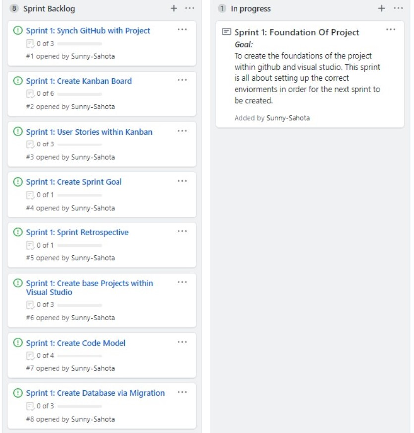
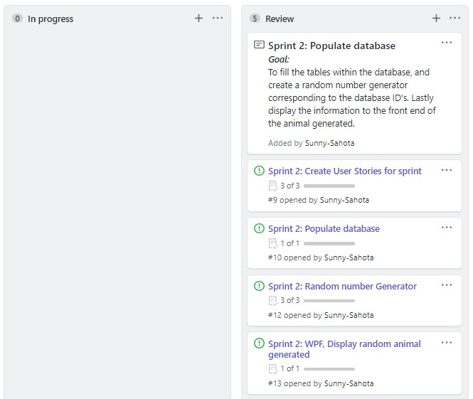
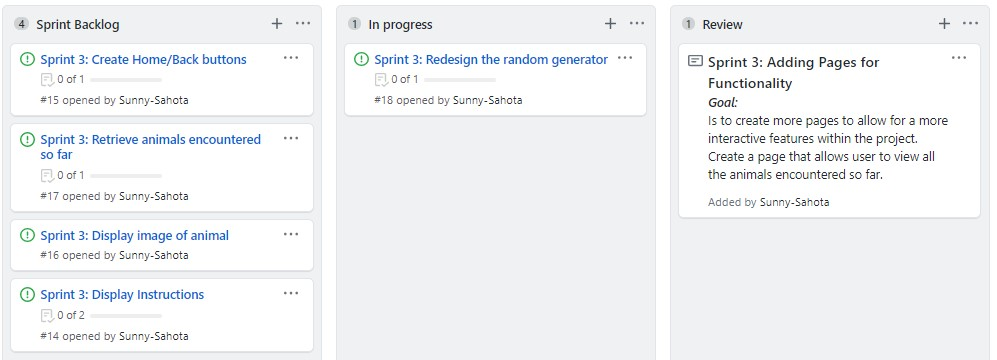
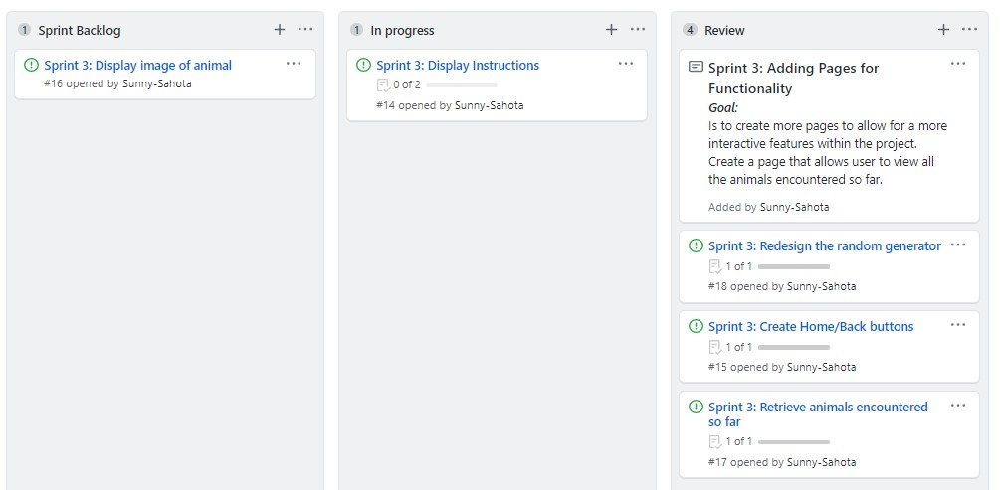
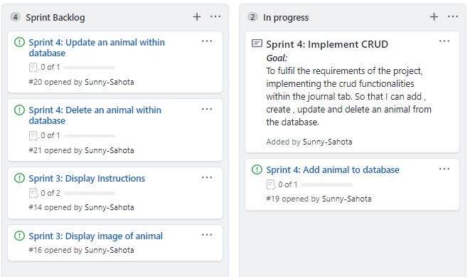
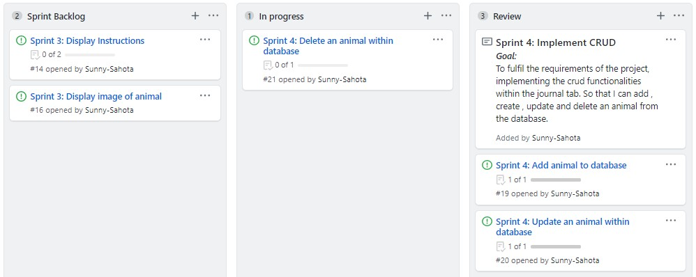
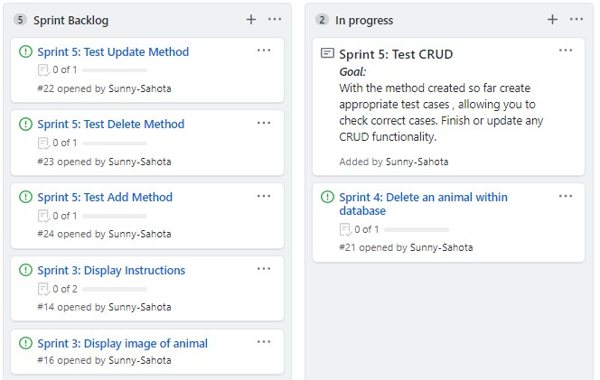
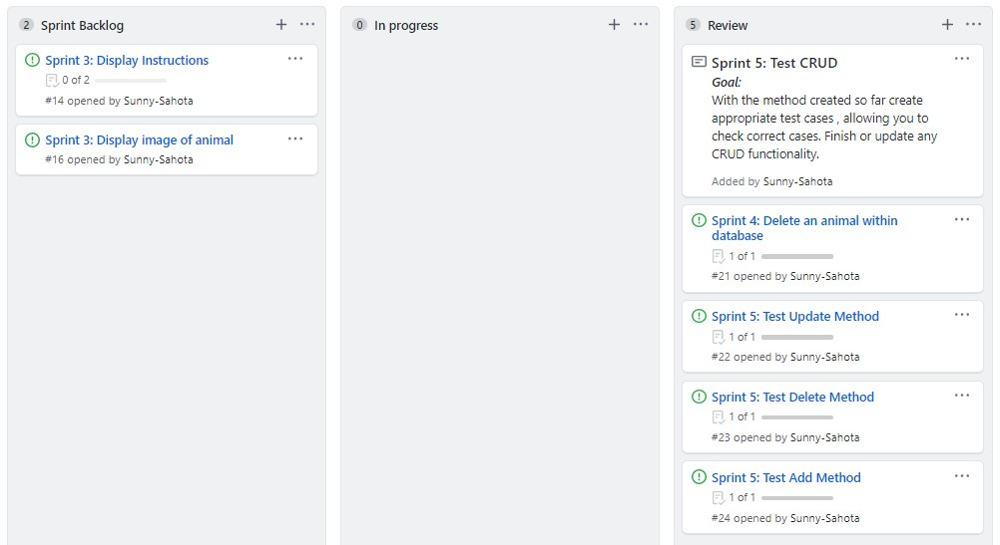

# Safari Explorer Project SpartaGlobal
### Project Goal:

>To create a three tier application, that allows a user to go on a safari and have a chance of encountering an animal. The user should be able to document information about the animal for later viewing.

### Project Defintion of done:

>The application should be able to communicate data between layers to enable the user to have a chance of encountering an animal. The user can then document thier findings which will be sotred within the database to allow them to view this data at any time.

#### Sprint 1: Foundation Of Project

>The goal of this sprint is to create the foundations of the project within github and visual studio. This sprint is all about setting up the correct enviorments in order for the next sprint to be created.

##### Sprint Review:
###### Start of Sprint:

###### End of Sprint:

##### Sprint Retrospective:

###### Tasks that went well:
1. Was able to work consistently to figure out how to populate the database and chose to use the automatically filled ID’s instead.
2. Became more familiar with using GitHub extension within visual studio.
###### Improvements:
Get more familiar with using the .md formatting to fully utilise its full capabilities.
List things that went well,  improvements and action plan.

#### Sprint 2: Populate Database

>The goal of this sprint is to fill the tables within the database and create a random number generator corresponding to the database ID's.  Lastly display the information to the front end of the animal generated.

##### Sprint Review:
###### Start of Sprint:

###### End of Sprint:

##### Sprint Retrospective:

###### Tasks that went well:
1. Changed the implementation of the table by using SQL instead of linq. Which allowed me to add data easily to the database.
2. Created the gui to show a random generated animal from the database.
###### Improvements:
Improve communication with my piers more so that I can get a better understanding of what went well during implementing. This additional information will allow me not to repeat the same mistakes they may have encountered.

#### Sprint 3: Additional pages to allow features to be implemented

>The goal is to create a gui that will hold the information created in the next sprint. This includes navigation via buttons.

##### Sprint Review:
###### Start of Sprint:

###### End of Sprint:

###### Actions for not done:
Due to experimenting with migrations, a rebuild of the data table had to be implemented. Since the tasks where not essential to project success, they were left for the next sprint.

##### Sprint Retrospective:

###### Tasks that went well:
1. Researched and implemented frames so that I could use the inbuilt class “navigate” to move through the program via buttons and on click metods.
2. Through trial and error, migrations where implemented to update the database tables in order to facilitate the next sprint.
###### Improvements:
Develop better decision making when ordering the priority of tasks to be completed. In order to reach vital tasks in earlier sprints.

#### Sprint 4: Implement CRUD operations

>This sprints goal is to implement the CRUD operations in order to communicate the necessary data required through the layers. 

##### Sprint Review:
###### Start of Sprint:

###### End of Sprint:

###### Actions for not done:
Prioritised the most important tasks for this sprint, which resulted me moving non completed tasks to next sprint. Delete method not implemented, due to it depending on the add method.

##### Sprint Retrospective:

###### Tasks that went well:
1. Fully implemented the add/Update methods and created relevant gui logic around it to display a professional format to user.
2. Using git repo to revert to a working state of the program. When faced within multiple errors.
###### Improvements:
Starting project sooner or reavaluating task priority in product backlog would have allowed me to get more feedback on harder issues faced later on in the project.

#### Sprint 5: Test CRUD operations

>The goal of the sprint is to test the CRUD methods implemented in previous sprint to fulfil criteria in definition of done. 

##### Sprint Review:
###### Start of Sprint:

###### End of Sprint:

###### Actions for not done:
Prioritised the most important tasks for this sprints goal.

##### Sprint Retrospective:

###### Tasks that went well:
Fully implemented the add/Update methods and created relevant gui logic around it to display a professional format to user.
###### Improvements:
To get feedback from stakeholders and piers on the state of the program in order to facilitate necessary changes to the product.

### Project Retrospective

>In this weeklong project I have learned many skills and techniques through completing tasks within the project backlog. Here are my most important:
>1. How to create a code model and implement migrations.
>2. Frames and navigation methods.
>3. Implementing CRUD functionality.
>4. Testing CRUD.
>5. Formatting xaml to facilitate a professional gui layer.
>6. Created a random generator that pulls an animal out of the database and displays it to the front end.
>7. Implemented and agile approach throughout the project, using Kanban to track the progress of tasks within project.
###### What I would do differently next time:
For the next project I think it is vital to understand the importance of tasks and to order them correctly. So that implementation of core features can be done earlier in the project. This allows for more feedback to be given on harder tasks completed. 
>For example, implementing CRUD functionalities during sprint 3 rather than 4 would have allowed me to get feedback and to test all before Friday. Which was the last chance to get feedback on work done. This would have highlighted issues within the program, my piers faced and overcame. Preventing me from doing similar mistakes.
###### What I will do next:
Now that I have implemented and tested CRUD, it will allow me to make a more tailor-made program and include all the features I had only partially added. For example:
>1. Random Animal Generated Feature, the next iteration of this would be to randomly select an animal and populate it in a User table of animals encountered (local user data table) rather than animals available (Pre-existing animal data). 
>2. The next feature to be implemented, is to then allow the user to take a quiz based upon a threshold of animals encountered for each quiz level. The more animals encountered the more quizzes the high the score. At present only a temporary solution exists for demonstration purposes. 
>3. A user experience level could have been created depending on the how many correct answers and total animals discovered. This would allow me to map all the data into the user table with a login. 
>3. Finally, more error handling that prevents users implementing invalid characters depending on the box content. Additionally, creating Drop down lists where necessary to prevent human error even further. Research was carried out but not implemented, the corresponding methods where regex and combo box to complete this feature. 

I have highlighted features that would be built on pre-existing foundations, to give a better understanding of the true intentions I had with the application at the start of the project.