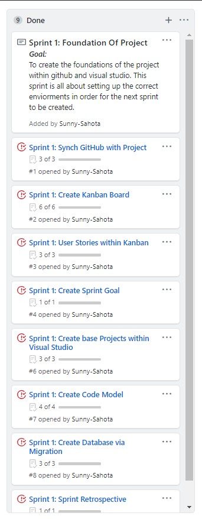

# Safari Explorer Project SpartaGlobal
### Project Goal:

>To create a three tier application, that allows a user to go on a safari and have a chance of encountering an animal. The user should be able to document information about the animal for later viewing.

### Project Defintion of done:

>The application should be able to communicate data between layers to enable the user to have a chance of encountering an animal. The user can then document thier findings which will be sotred within the database to allow them to view this data at any time.

#### Sprint 1: Foundation Of Project

>The goal of this sprint is to create the foundations of the project within github and visual studio. This sprint is all about setting up the correct enviorments in order for the next sprint to be created.

##### Sprint Review:

##### Sprint Retrospective:

###### Tasks that went well:
1. Was able to work consistently to figure out how to populate the database and chose to use the automatically filled ID’s instead.
2. Became more familiar with using GitHub extension within visual studio.
###### Improvements:
Get more familiar with using the .md formatting to fully utilise its full capabilities.
List things that went well,  improvements and action plan.